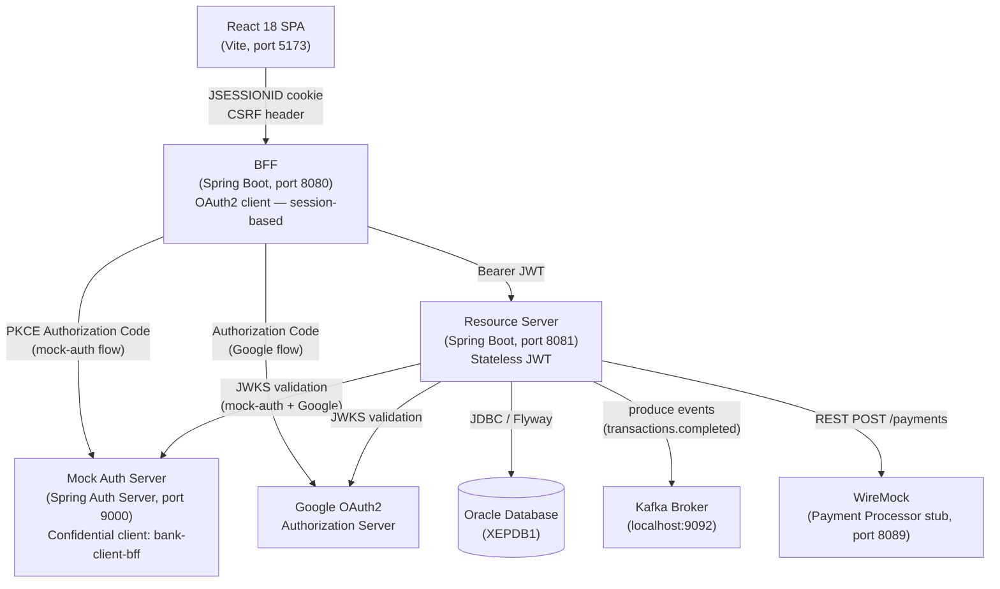

# Architecture

## System diagram

## BFF rationale

The Browser-for-Frontend pattern keeps OAuth2 tokens server-side.  
The React SPA never holds a JWT or client secret — it only carries an
`HttpOnly JSESSIONID` cookie issued by the BFF.  This prevents token theft
via XSS because JavaScript cannot read `HttpOnly` cookies.

CSRF is mitigated with `CookieCsrfTokenRepository` (read the token from the
`XSRF-TOKEN` cookie and echo it back in the `X-XSRF-TOKEN` request header).

## Key technologies

| Concern | Choice |
|---|---|
| **Frontend** | React 18, Vite, native `fetch` (no Axios) |
| **BFF** | Java 17, Spring Boot 3.x, Spring Security OAuth2 Client |
| **Resource Server** | Spring Boot 3.x, Spring Security OAuth2 Resource Server |
| **Database** | Oracle 21c XE, Spring Data JPA, Flyway |
| **Events** | Apache Kafka, Spring Kafka |
| **Mock IdP** | Spring Authorization Server (in-memory users + custom JWT claims) |
| **Payment stub** | WireMock standalone |
| **Testing** | JUnit 5, Mockito, MockMvc, `@EmbeddedKafka`, H2 (Oracle mode) |

## Module responsibilities

### mock-auth (port 9000)

Spring Authorization Server configured as a PKCE public-client IdP.  
Two in-memory users — `alice/password` (CUSTOMER) and `admin/password` (ADMIN).  
A `TokenCustomizer` adds a `"role"` claim to every issued JWT so the
Resource Server can derive the `UserRole` without a database lookup at
token issuance time.

### BFF (port 8080)

Session-based OAuth2 client.  Registers two providers:

- `mock-auth` — used when the user clicks "Sign in (Demo)"
- `google` — used when the user clicks "Sign in with Google"

After the authorization code exchange, the BFF holds the access token in
the server-side `HttpSession` and proxies every `/api/**` call to the
Resource Server, forwarding the JWT as a `Bearer` token.

### Resource Server (port 8081)

Stateless JWT validator.  Key components:

- **`JwtDecoderConfig`** — builds a `JwtDecoder` that accepts tokens from
  both `mock-auth` (issuer `http://localhost:9000`) and Google.
- **`JwtAuthConverter`** — converts a validated `Jwt` into a
  `JwtAuthenticationToken`.  On first login it upserts a `BANK_USERS` row
  (subject → local `userId`); the local `userId` becomes the
  `Authentication#getName()`.  The `role` JWT claim is mapped to
  `ROLE_CUSTOMER` or `ROLE_ADMIN` authority.
- **`GlobalExceptionHandler`** — maps domain exceptions to RFC 7807-style
  JSON bodies.
- **`TransactionEventPublisher`** — fires a `TransactionEvent` to the
  `transactions.completed` Kafka topic after every committed transaction.

